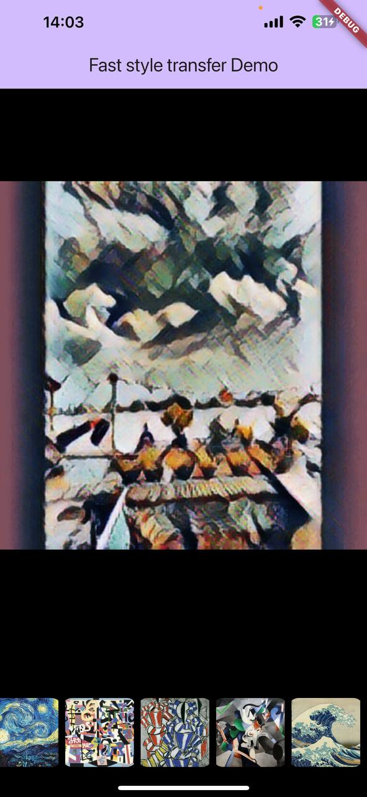
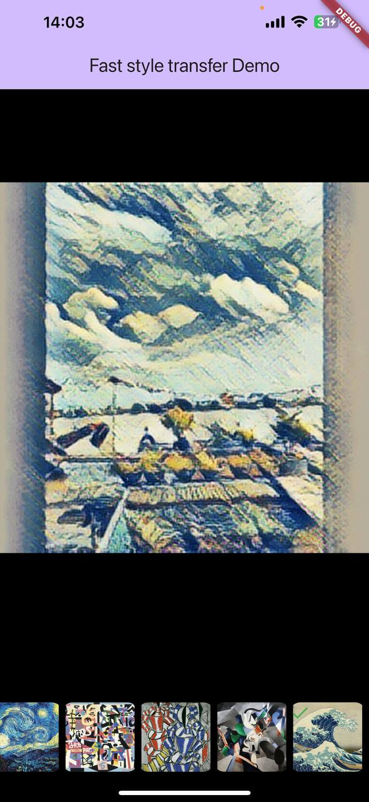
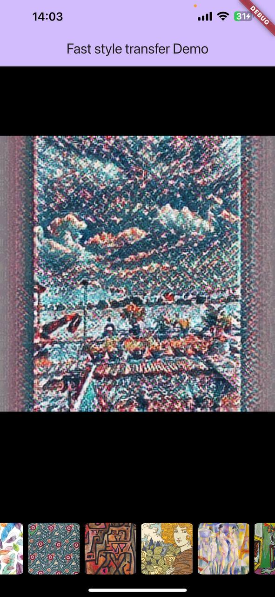
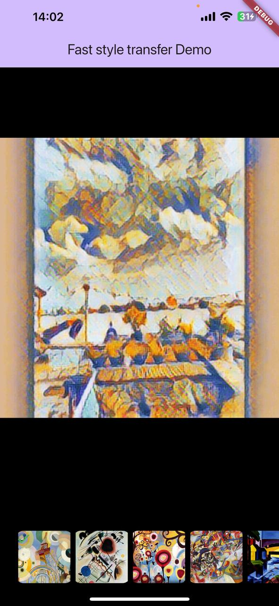

# Fast Style Transfer Flutter 🎨

A Flutter package for running **Fast Neural Style Transfer** using **TensorFlow Lite (TFLite)** models, enabling real-time image transformation on **Android** and **iOS** devices **locally** (no internet connection required).

> 💡 Based on the original [Fast Style Transfer](https://github.com/lengstrom/fast-style-transfer) by Logan Engstrom and inspired by [luiscib3r/style_transfer](https://github.com/luiscib3r/style_transfer). Special thanks to them!

---

## 🧠 How It Works

1. Loads **two models**:
    - `predict.tflite`: extracts style features
    - `transfer.tflite`: applies style to the input image
2. Preprocesses the input content & style images
3. Runs both models sequentially
4. Returns JPEG-encoded image as `Uint8List`

---

## 📂 Supported Model Loading

You can load models from:

- Assets (recommended)
- File path (`File`)
- Raw bytes (`Uint8List`)


## 📸 Example

```dart
final styleTransfer = FastStyleTransferFlutter.init(
  config: FastStyleTransferConfig(
    thread: 4,
    useGPU: true,
    loaderConfig: FastStyleAssetsLoaderConfig(
      predictResource: 'models/predict.tflite',
      styleTransferResource: 'models/transfer.tflite',
    ),
  ),
);

final resultImage = await styleTransfer.run(
  request: RunTransferRequest(
    image: imageBytes, // content image (Uint8List)
    style: styleBytes, // style image (Uint8List)
  ),
);

// Use resultImage as Uint8List (e.g., display or save)
```

## 📸 Screenshots

<p align="center">
  
  
  
  
</p>

---

## 📥 Model Download

You can use pre-trained models provided by TensorFlow:

- [magenta_arbitrary-image-stylization-v1-256_int8_prediction_1.tflite](https://storage.googleapis.com/download.tensorflow.org/models/tflite/task_library/style_transfer/android/magenta_arbitrary-image-stylization-v1-256_int8_prediction_1.tflite)
- [magenta_arbitrary-image-stylization-v1-256_int8_transfer_1.tflite](https://storage.googleapis.com/download.tensorflow.org/models/tflite/task_library/style_transfer/android/magenta_arbitrary-image-stylization-v1-256_int8_transfer_1.tflite)

These models are compatible with this package and ready to be used.

You can also train or convert your own models based on:

- Original: [Fast Style Transfer](https://github.com/lengstrom/fast-style-transfer)
- Mobile conversion guide: [luiscib3r/style_transfer](https://github.com/luiscib3r/style_transfer)

## 🙏 Credits
- Huge thanks to Logan Engstrom for the original Fast Style Transfer.
- Special appreciation to luiscib3r for mobile adaptation inspiration and open-source contribution.